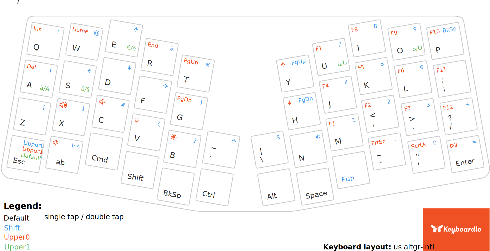

# Keyboardio Atreus Firmaware
My Keyboardio Atreus firmware. Based on the standard US layout, with some additional modifications to add German language keys.

## Depends on

- [Kaleidoscope](https://github.com/keyboardio/Kaleidoscope)
- arduino-cli


## Build/Flash firmware

- Make sure [Kaleidoscope](https://github.com/keyboardio/Kaleidoscope) is checked out and the `KALEIDOSCOPE_DIR` environment variable is set ([see Kaleidoscope readme](https://github.com/keyboardio/Kaleidoscope#use-git-to-check-out-a-copy-of-kaleidoscope)).
- `make compile` to build
- `make flash` to flash

## Usage




Set the keyboard layout to ` us altgr-intl`, e.g. on Arch Linux:
```
localectl set-x11-keymap us altgr-intl
```
The firmware is based on the default firmware and adds a second `UPPER_1` layer, accessible by tapping the `Esc` key from the first `UPPER_0` layer. It provides the following Key bindings:

- A -> ä (single tap); Ä (double tap)
- U -> ü (single tap); Ü (double tap)
- O -> ö (single tap); Ö (double tap)
- S -> ß (single tap); § (double tap)
- E -> € (single tap); é (double tap)
- See the [keyboard layout SVG](./atreus-layout-card.svg) for more.

When in one of the `UPPER` layers, the `Fn` key switches down a layer, and back to the default layer when in `UPPER_0` and the `Esc` key switches up a layer, and back to the default layer when in the `UPPER_1` layer.
